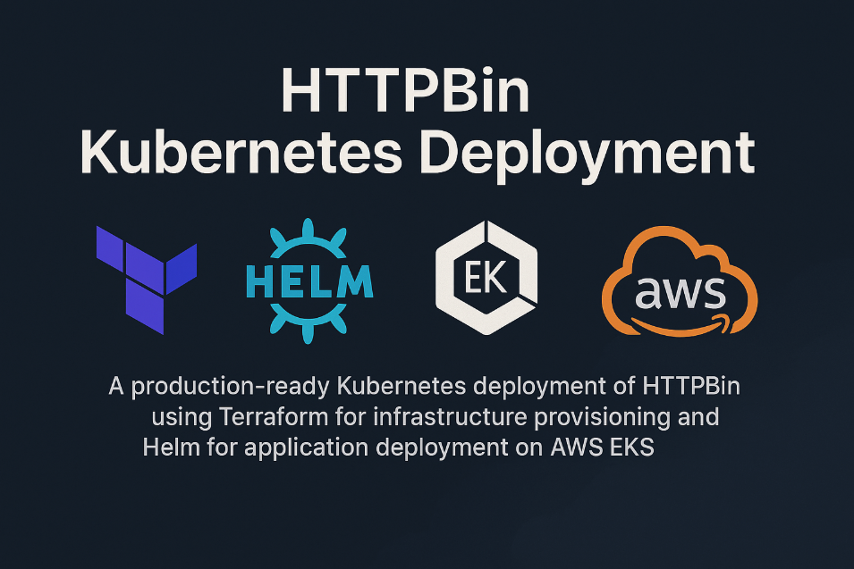
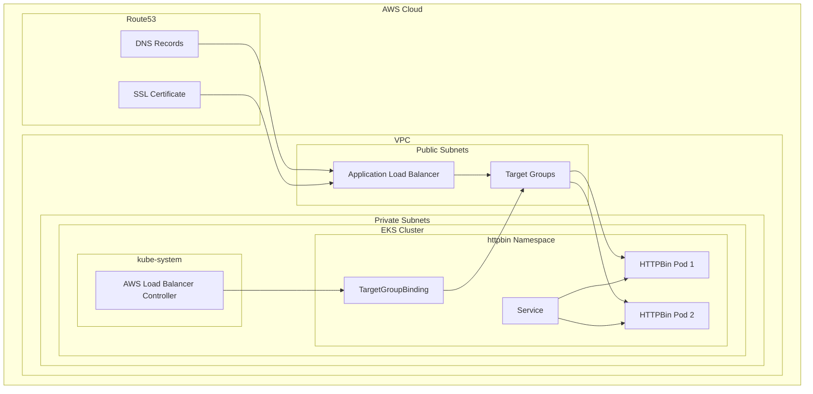

# HTTPBin Kubernetes Deployment



A production-ready Kubernetes deployment of HTTPBin using **Terraform** for infrastructure provisioning and **Helm** for application deployment on **AWS EKS**. This project demonstrates DevOps best practices including Infrastructure as Code, GitOps workflows, security hardening, and cloud-native architecture patterns.

## 🏗️ Architecture Overview



### **Key Components:**
- **VPC**: Custom networking with public/private subnets across 2 AZs
- **EKS Cluster**: Managed Kubernetes with RBAC and security groups
- **Application Load Balancer**: HTTPS termination with Route53 integration
- **Helm Chart**: Templated Kubernetes manifests with best practices
- **Security**: Network policies, pod security contexts, least privilege IAM

## 🚀 Quick Start

### **Prerequisites**
- [AWS CLI v2](https://docs.aws.amazon.com/cli/latest/userguide/install-cliv2.html) configured with SSO
- [Terraform](https://developer.hashicorp.com/terraform/downloads) v1.12.2+
- [kubectl](https://kubernetes.io/docs/tasks/tools/) for cluster interaction
- [Helm](https://helm.sh/docs/intro/install/) (optional, managed by Terraform)
- Valid AWS domain in Route53 for SSL certificate

### **Deployment Steps**

```bash
# 1. Clone the repository
git clone git@github.com:dimitar-ivanov-93/httpbin.git
cd httpbin

# 2. Configure AWS credentials
aws sso login --profile your-profile

# 3. Deploy infrastructure (EKS, VPC, ALB)
cd infra
terraform init
terraform apply

# 4. Deploy application (HTTPBin Helm chart)
cd ../helm
terraform init
terraform apply

# 5. Verify deployment
kubectl get pods -n httpbin
curl https://your-domain.com/get
```

## 📋 Detailed Prerequisites

### **1. AWS Authentication Setup**
```bash
# Configure AWS SSO (recommended)
aws configure sso

# Verify access
aws sts get-caller-identity
```

### **2. Required AWS Resources**
- **Route53 Hosted Zone**: For domain management and SSL certificates
- **IAM Permissions**: EKS cluster creation, VPC management, Route53 access

### **3. Optional AWS Resources**
- **S3 Bucket**: For Terraform state storage (optional, can use local state)
- **DynamoDB Table**: For Terraform state locking (if using S3 backend)

### **4. Domain Requirements**
You need a domain managed by Route53 for:
- SSL certificate validation
- ALB DNS alias records
- HTTPS traffic routing

## ⚙️ Configuration

### **Infrastructure Variables**

Create `infra/terraform.tfvars`:
```hcl
# Required Variables
personal_access_principal_arn = "arn:aws:iam::ACCOUNT:role/aws-reserved/sso.amazonaws.com/ROLE_NAME"
primary_domain_hosted_zone_id = "Z1234567890ABC"
domain_name                   = "httpbin.yourdomain.com"

# Optional Overrides
public_access_cidr              = "YOUR_PUBLIC_IP/32"
vpc_cidr                        = "10.1.0.0/22"
cluster_endpoint_public_access  = true
cluster_name                    = "httpbin"
region                         = "eu-central-1"
node_group_instance_types      = ["t3.medium"]
node_group_desired             = 2
```

### **Variable Descriptions**

| Variable | Description | Required | Example |
|----------|-------------|----------|---------|
| `personal_access_principal_arn` | Your AWS SSO role ARN for EKS access | Yes | `arn:aws:iam::123456789:role/aws-reserved/...` |
| `primary_domain_hosted_zone_id` | Route53 hosted zone ID | Yes | `Z1234567890ABC` |
| `domain_name` | Full domain name for the application | Yes | `httpbin.example.com` |
| `public_access_cidr` | Your public IP for ALB/EKS access | No | `203.0.113.1/32` |
| `vpc_cidr` | VPC CIDR block | No | `10.1.0.0/22` |
| `cluster_endpoint_public_access` | Enable public EKS API access | No | `true` |

### **Backend Configuration (Optional)**

If you want to use S3 backend, update `infra/backend.tf` and `helm/backend.tf`:
```hcl
terraform {
  backend "s3" {
    bucket         = "your-terraform-state-bucket"
    key            = "httpbin/infra/terraform.tfstate"
    region         = "us-east-1"
    dynamodb_table = "your-terraform-lock-table"
    encrypt        = true
  }
}
```

## 🏗️ Infrastructure Deployment

### **Step 1: Deploy Core Infrastructure**

```bash
cd infra

# Initialize Terraform
terraform init

# Review planned changes
terraform plan

# Apply infrastructure
terraform apply
```

**This creates:**
- VPC with public/private subnets
- EKS cluster with managed node groups
- Application Load Balancer
- SSL certificate with Route53 validation
- IAM roles for AWS Load Balancer Controller
- Security groups with least privilege access

### **Step 2: Verify Infrastructure**

```bash
# Configure kubectl
aws eks update-kubeconfig --region eu-central-1 --name httpbin

# Check cluster status
kubectl get nodes
kubectl get pods -A

# Verify AWS Load Balancer Controller
kubectl get pods -n kube-system -l app.kubernetes.io/name=aws-load-balancer-controller
```

## 📦 Application Deployment

### **Step 3: Deploy HTTPBin Application**

```bash
cd ../helm

# Initialize Terraform
terraform init

# Deploy Helm chart
terraform apply
```

**This deploys:**
- HTTPBin pods with health checks and security contexts
- Kubernetes Service (ClusterIP)
- TargetGroupBinding for ALB integration
- PodDisruptionBudget for high availability
- NetworkPolicy for traffic restriction
- TopologySpreadConstraints for even distribution

### **Step 4: Verify Application**

```bash
# Check pod status
kubectl get pods -n httpbin

# View pod logs
kubectl logs -l app=httpbin -n httpbin

# Check service endpoints
kubectl get svc -n httpbin
kubectl get targetgroupbinding -n httpbin

# Test application
curl https://your-domain.com/get
```

## 🔒 Security Features

### **Network Security**
- **VPC Isolation**: Private subnets for worker nodes
- **Security Groups**: Restrictive ingress/egress rules
- **Network Policies**: Pod-to-pod communication control
- **Public Access**: Limited to specified CIDR ranges

### **Pod Security**
- **Resource Limits**: CPU and memory constraints
- **Health Checks**: Startup, readiness, and liveness probes
- **Capabilities**: Dropped ALL Linux capabilities

### **IAM & RBAC**
- **Service Accounts**: IRSA for AWS Load Balancer Controller
- **EKS Access Entries**: Principle-based cluster access
- **Least Privilege**: Minimal required permissions

## 📊 Monitoring & Observability

### **Health Checks**
```bash
# Pod health status
kubectl get pods -n httpbin

# Service endpoints
kubectl get endpoints -n httpbin

# ALB target group health
aws elbv2 describe-target-health --target-group-arn $(aws elbv2 describe-target-groups --names k8s-httpbin --query 'TargetGroups[0].TargetGroupArn' --output text)
```

## 🔄 Rolling Updates

Demonstrate zero-downtime deployments:

```bash
# Method 1: Update deployment version
helm upgrade httpbin ./charts/httpbin -n httpbin --set deploymentVersion=v2

# Method 2: Restart deployment
kubectl rollout restart deployment/httpbin -n httpbin

# Watch rolling update
kubectl rollout status deployment/httpbin -n httpbin
kubectl get pods -n httpbin -w
```

## 🧪 Testing & Validation

### **Infrastructure Tests**
```bash
# Validate Terraform configuration
terraform validate
terraform plan

# Check EKS cluster
aws eks describe-cluster --name httpbin

# Verify ALB
aws elbv2 describe-load-balancers --names httpbin-alb
```

## 🧹 Cleanup

### **Destroy Resources**
```bash
# Remove application
cd helm
terraform destroy

# Remove infrastructure
cd ../infra
terraform destroy

# Verify cleanup
aws eks list-clusters
aws elbv2 describe-load-balancers
```

**Estimated Cost:** ~$0.50/hour for demo environment

## 🐛 Troubleshooting

### **Common Issues**

**1. EKS Access Denied**
```bash
# Update kubeconfig
aws eks update-kubeconfig --region eu-central-1 --name httpbin

# Check IAM permissions
aws sts get-caller-identity
```

**2. ALB Target Group Unhealthy**
```bash
# Check security group rules
kubectl describe targetgroupbinding -n httpbin

# Verify pod health
kubectl describe pods -n httpbin
```

**3. SSL Certificate Issues**
```bash
# Check certificate validation
aws acm describe-certificate --certificate-arn <cert-arn>

# Verify Route53 records
aws route53 list-resource-record-sets --hosted-zone-id <zone-id>
```

**4. Pod CrashLoopBackOff**
```bash
# Check pod logs
kubectl logs -l app=httpbin -n httpbin --previous

# Describe pod events
kubectl describe pods -n httpbin
```

## 📁 Project Structure

```
httpbin/
├── README.md                          # This file
├── .gitignore                         # Git ignore patterns
├── infra/                             # Infrastructure Terraform
│   ├── backend.tf                     # State backend configuration
│   ├── providers.tf                   # AWS/Kubernetes providers
│   ├── variables.tf                   # Input variables
│   ├── terraform.tfvars              # Variable values (gitignored)
│   ├── locals.tf                     # Local values
│   ├── data.tf                       # Data sources
│   ├── vpc.tf                        # VPC and networking
│   ├── eks.tf                        # EKS cluster configuration
│   ├── alb.tf                        # Application Load Balancer
│   ├── iam.tf                        # IAM roles and policies
│   ├── cert.tf                       # SSL certificate management
│   ├── route53.tf                    # DNS configuration
│   ├── aws-controller.tf             # AWS Load Balancer Controller
│   └── aws_controller_policy.json    # IAM policy document
└── helm/                             # Application Terraform
    ├── backend.tf                    # State backend configuration
    ├── providers.tf                  # Helm/Kubernetes providers
    ├── variables.tf                  # Input variables
    ├── data.tf                       # Data sources (EKS cluster)
    ├── helm.tf                       # Helm release configuration
    └── charts/httpbin/               # Custom Helm chart
        ├── Chart.yaml                # Chart metadata
        ├── values.yaml               # Default values
        └── templates/                # Kubernetes manifests
            ├── _helpers.tpl          # Template helpers
            ├── deployment.yaml       # Pod deployment
            ├── service.yaml          # Service configuration
            ├── targetgroupbinding.yaml # ALB integration
            ├── pdb.yaml              # Pod disruption budget
            └── networkpolicy.yaml    # Network security policy
```

## 🎯 Technical Highlights

### **DevOps Best Practices Demonstrated**
- ✅ Infrastructure as Code with Terraform modules
- ✅ GitOps workflow with versioned Helm charts
- ✅ Zero-downtime deployments with rolling updates
- ✅ Comprehensive security hardening
- ✅ Automated SSL certificate management
- ✅ Health checks and observability
- ✅ Resource optimization and cost management

### **Kubernetes Expertise Showcased**
- ✅ Custom Helm chart development
- ✅ Pod topology spread constraints
- ✅ Network policies for microsegmentation
- ✅ Service mesh integration readiness
- ✅ RBAC and security contexts

### **Cloud-Native Architecture**
- ✅ AWS EKS managed Kubernetes
- ✅ Application Load Balancer integration
- ✅ Route53 DNS and certificate automation
- ✅ VPC networking with security groups
- ✅ IAM roles for service accounts (IRSA)
- ✅ Multi-AZ deployment for high availability

## 📚 Additional Resources

- [AWS EKS Documentation](https://docs.aws.amazon.com/eks/)
- [Terraform AWS Provider](https://registry.terraform.io/providers/hashicorp/aws/latest)
- [Helm Chart Development](https://helm.sh/docs/chart_template_guide/)
- [Kubernetes Security Best Practices](https://kubernetes.io/docs/concepts/security/)

---

**Contact Information:**
- **Name**: Dimitar Ivanov
- **Email**: mitko930119@gmail.com
- **Project**: HTTPBin Kubernetes Deployment Demo

*This project demonstrates production-ready DevOps practices suitable for enterprise Kubernetes deployments.*